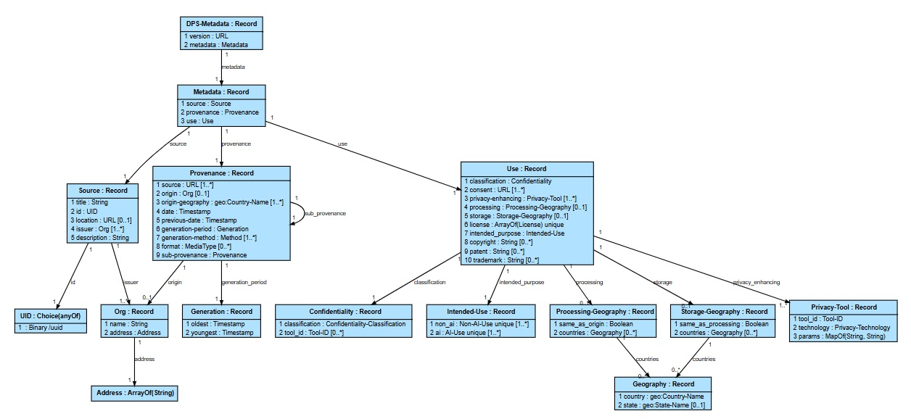

# DPS Draft Information Model

This directory contains the proposed DPS information model created by harmonizing an IM designed by examining the D&TA
metadata generator tool, and one generated automatically from the initial JSON Schema submission.

The IM is represented in equivalent file formats:

1. **JADN:** The authoritative JSON data format
```json
    ["Metadata", "Record", [], "The Data Provenance Standard Metadata", [
      [1, "source", "Source", [], "Describes a dataset and the source of the dataset."],
      [2, "provenance", "Provenance", [], "Provenance of the dataset."],
      [3, "use", "Use", [], "Legal use and restrictions."]
    ]],

    ["Source", "Record", [], "", [
      [1, "title", "String", [], "The official name of the dataset, which should be descriptive and help easily identify the dataset's content and purpose."],
      [2, "id", "UID", [], "Unique metadata identifier"],
      [3, "location", "URL", ["[0"], "Metadata location"],
      [4, "issuer", "Org", ["]-1"], "Data issuer  (many?)"],
      [5, "description", "String", [], "Description of the dataset"]
    ]],
```
2. **JIDL:** A text "source code" format suitable for discussion and publication in the DPS Committee Specification
```
Metadata = Record                                // The Data Provenance Standard Metadata
   1 source           Source                     // Describes a dataset and the source of the dataset.
   2 provenance       Provenance                 // Provenance of the dataset.
   3 use              Use                        // Legal use and restrictions.

Source = Record
   1 title            String                     // The official name of the dataset, which should be descriptive and help easily identify the dataset's content and purpose.
   2 id               UID                        // Unique metadata identifier
   3 location         URL optional               // Metadata location
   4 issuer           Org [1..*]                 // Data issuer  (many?)
   5 description      String                     // Description of the dataset
```
3. **Markdown:** Tables suitable for publication in the DPS spec, if a table format is preferred  by the TC

**********

The Data Provenance Standard Metadata

**Type: Metadata (Record)**

| ID | Name           | Type       | \# | Description                                        |
|----|----------------|------------|----|----------------------------------------------------|
| 1  | **source**     | Source     | 1  | Describes a dataset and the source of the dataset. |
| 2  | **provenance** | Provenance | 1  | Provenance of the dataset.                         |
| 3  | **use**        | Use        | 1  | Legal use and restrictions.                        |

**********

**Type: Source (Record)**

| ID | Name            | Type   | \#    | Description                                                                                                               |
|----|-----------------|--------|-------|---------------------------------------------------------------------------------------------------------------------------|
| 1  | **title**       | String | 1     | The official name of the dataset, which should be descriptive and help easily identify the dataset's content and purpose. |
| 2  | **id**          | UID    | 1     | Unique metadata identifier                                                                                                |
| 3  | **location**    | URL    | 0..1  | Metadata location                                                                                                         |
| 4  | **issuer**      | Org    | 1..\* | Data issuer  (many?)                                                                                                      |
| 5  | **description** | String | 1     | Description of the dataset                                                                                                |

**********

4. **[Graphviz](https://graphviz.org/):** An entity relationship diagram (ERD) graphical format, viewable online at
[Sketchviz](https://sketchviz.com/new). JADN models can also be viewed as [PlantUML](https://plantuml.com/) ER diagrams.

