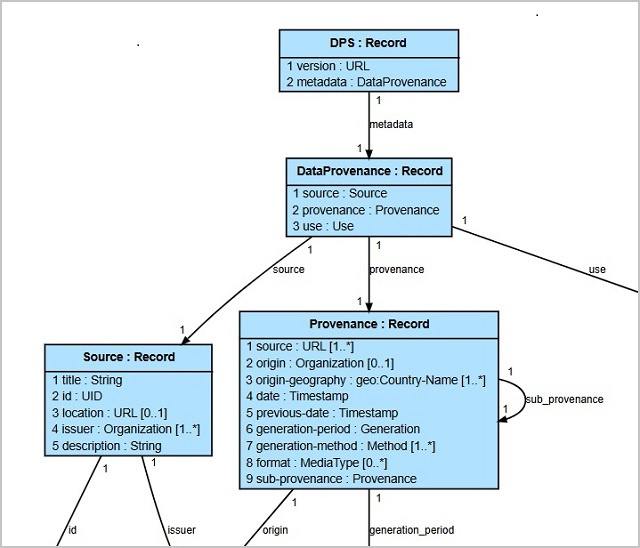
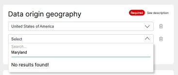

# An Information Model for DPS

The OASIS Data Provenance Standards
([DPS](https://docs.google.com/document/d/1FswDKOteTbMfBU9bfQGO9xH2MIRwaAcx))
Technical Committee will define a standardized format for provenance metadata that captures
where data comes from, how it is created, and whether it can be used legally.
An information model (IM) is a declarative specification that defines the essential content
of data items (messages, documents, structures, database values) independently of data format.

An IM is initially used for conceptual design: listing and naming the entities in DPS metadata.
The conceptual design can proceed both top-down starting with high level requirements and bottom-up
starting with pre-defined entities:


The IM is then refined as entities and their attributes are revised, decided, and documented:



The purpose of information modeling is to enable continuous evolution from concept to detailed
design to multiple implementations based on the same specification.
An information model is the single source of truth used to construct metadata generator
tools, validate provenance metadata regardless of how it is created, translate metadata across
multiple supported data formats without loss, and document the DPS specification in a form
suitable for publication.

[JADN](https://docs.oasis-open.org/openc2/jadn/v2.0/jadn-v2.0.html)
is an information modeling language created by the OASIS
[OpenC2](https://groups.oasis-open.org/communities/tc-community-home2?CommunityKey=a34c9baf-48b2-44c5-a567-018dc7d32296)
TC to define the Open Command and Control cybersecurity protocol.
This document describes how JADN can be used to define and document the Data Provenance Standard.

## License
This document is released under the Creative Commons
[CC-BY-SA-4.0](https://creativecommons.org/licenses/by-sa/4.0/) license.

## Process
* The Data&Trust Alliance contributed to the DPS TC:
  * Metadata Generation
    [software](https://groups.oasis-open.org/higherlogic/ws/groups/2c60b2cf-45d3-48cd-8594-0194f182b33d/documents/dps3709/document?document_id=72724)
    and an online [metadata generator](https://data-and-trust-alliance-data-provenance-standards.northeurope.cloudapp.azure.com/)
    that produces JSON, YAML, XML and CSV metadata files.
  * preliminary
    [JSON Schema](https://groups.oasis-open.org/higherlogic/ws/groups/2c60b2cf-45d3-48cd-8594-0194f182b33d/download/72727)
    and placeholder for JSON examples
  * placeholder for [XML Schema](https://groups.oasis-open.org/higherlogic/ws/groups/2c60b2cf-45d3-48cd-8594-0194f182b33d/download/72728)
    and XML examples
  
*NOTE: This description will be updated to reference the newly-contributed JSON, XML and YAML schemas*

* OpenC2 developers:
  * Examined the Metadata Generator to **design** an [IM](schemas/Designed) based on requirements inferred from its user interface,
    focused on capturing intent and desired capabilities.
  * Translated the JSON Schema to **generate** an [IM](schemas/Generated), to put the initial schema in IM format.
  * Compared the designed and generated IMs to identify gaps/deficiencies of each and inconsistencies between them.
  * Produced a **draft** [IM](schemas/DPS) based on the gap analysis for use in the Metadata specification.

## Gap Analysis

Metadata Generator:


### Designed IM
Design is a human process involving pattern recognition, judgement calls among multiple options
and the likelihood of errors and omissions. The [designed IM](schemas/Designed/dps-designed.jidl) was created by *analyzing*
the user interface of the online Metadata Generator and modeling the information needed to replicate
that UI. Alternatively an IM can be *synthesized* by white-boarding a conceptual model then
defining a declarative IM to instantiate the desired tool using a general purpose
spec-driven toolkit written in any programming language and UI library.

```
Source = Record
   1 name             String                     // Dataset title/name
   2 uid              UID                        // Unique metadata identifier
   3 location         URL optional               // Metadata location
   4 issuer           Organization [1..*]        // Data issuer
   5 description      String                     // Description of the dataset

UID = Choice(anyOf)
   1  Binary /uuid                               // uuid::

Org = Record
   1 name             String                     // organization name
   2 address          String [0..*]              // address line
```

* The Source dataset attribute could be called "name" or "title"; we chose name while the
JSON Schema used title; neither is evident from looking at the Generator.
Either one works of course, but the TC will decide which is clearest.
* The Unique metadata identifier uses UUID as an example, but the JSON Schema allows
any string, including absurd examples such as the Gettysburg Address, in that attribute.
The designed IM defines a UID type which could be an RFC 4122 UUID, and the TC can add other
identifiers such as URLs as driven by use cases, while still not considering the Gettysburg
Address to be a valid identifier. For String attributes like the Dataset name, JADN applies a
default max length of 255 characters unless overridden by an explicit max length.
* A UUID is a 128 bit value which in JSON data is the RFC 4122 hex-with-dashes text
representation. An information model defines the native values of all types,
and in binary data formats like CBOR or transmission formats like HTTP2 the native
data is used rather than a text representation.
* The Source.issuer attribute is an "Organization" with a name and 0 or more address lines
as seen in the Generator. JADN includes multiplicity syntactic sugar `[1..*]` to make
information models more compact. Multiplicity yields an array of items when converting
an IM to JSON Schema.
* All entities have a name which makes them reusable and supports the "Don't Repeat
Yourself" design principle. In the Generator both the Source.issuer and
Provenance.source attribute types are a single Organization entity, in contrast to the
JSON Schema which defines a new type each time it is used.

### Generated IM

* Within JSON Schema the \$defs keyword provides a standardized way to define reusable
subschemas within a single schema document, promoting modularity, reducing code duplication,
and improving schema organization. An IM defines a name for each type and generating a
JSON Schema from an IM preserves those names. The D&TA schema does not use $defs so all
types are anonymous. For some types it is possible to guess a type name by capitalizing
its property name, but for others, particularly the root type (e.g., DPS-Metadata) the
JSON Schema provides nothing to support a guess.
* The Generator tool does not have a "version" attribute in the Source section but the JSON Schema
(and JSON metadata) does. The TC may choose to retain it, but the schema version applies
to the entire schema and would typically be specified at an outer level or in a header
rather than as an attribute of a subtype.
* As mentioned above, without named types there is no "Organization" type that can be reused
as properties of both Source and Provenance.

```
Root.source = Record                             // This describes a dataset and the source of the dataset.
   1 version          String                     // Specifies the version of the schema or standards used to 
   2 title            String                     // The official name of the dataset, which should be descri
   3 id               String                     // A distinct identifier (such as a UUID) assigned to the d
   4 location         String optional            // The web address where the dataset's metadata is publishe
   5 issuer           Issuer                     // The legal entity responsible for creating the dataset, p
   6 description      String                     // Contains a detailed narrative that explains the contents

Issuer = ArrayOf(Issuer-item){1..*}              // The legal entity responsible for creating the dataset, p

Issuer-item = Record
   1 name             String
   2 address          Address optional

Address = ArrayOf(String)
```

* The Generator tool supports countries (ISO 3166-1) but not subdivisions within countries
  (ISO 3166-2). The JSON Schema and its derived IM supports both country and state but
  allows any string as values. The purpose of using an IM is to:
  * design an IM that supports both country and state
  * validate the allowed values of countries and their states using references to ISO 3166, and
  * control the Generator user interface to ensure that it remains synced with schemas and data

Generated IM:
```
Origin-geography = ArrayOf(Origin-geography-item){1..*} // The geographical location where the data was orig

Origin-geography-item = Record
   1 country          String
   2 state            String optional
```
Desired IM:
```
Location = Record
   1 country          geo:CountryName                         // Codelist IM derived from ISO-3166-1
   2 state            geo:StateName(TagId[country]) optional  // Choice indexed by country - TBD
```



## Outputs
* [Draft DPS Information Model](schemas/DPS)
* Issue discussion and resolution (GitHub issues? Issues document?)
  1. **DPS Version** - outer wrapper, top-level property, or Source property?
  2. **Type and Property Naming Conventions** - `Capitalized` types (PascalCase and Train-Case), `snake_case` properties
  3. **DPS Spec IM Format** - Information Definition Language or Property Tables?
  4. **Geography** - Country only (Metadata Generator) or Country + State (JSON Schema)? 
  5. ...